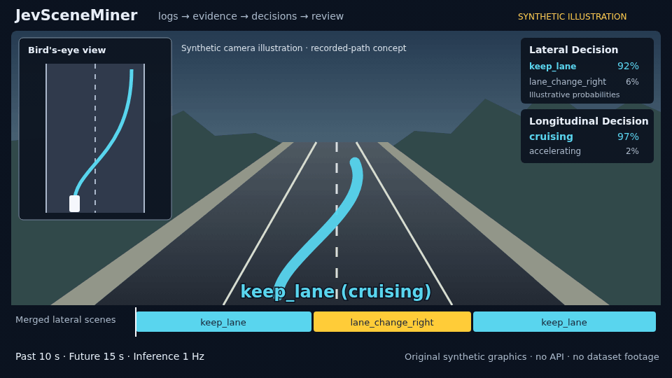

# JevSceneMiner

[](https://github.com/bskkimm/JevSceneMiner/actions/workflows/ci.yml)
[](LICENSE)

Find and review driving maneuvers in Autoware rosbags and [nuPlan](https://www.nuscenes.org/nuplan) logs with [Jev](https://docs.typesafe.ai/introduction).
Describe recorded motion and map evidence, classify each moment, and merge answers into timestamped scenes.



*Illustrative animation with synthetic motion and labels. It demonstrates the layout; it is not a camera recording or an accuracy benchmark.*

```text
Autoware MCAP + Lanelet2 map ─┐
                            ├─► shared ego/object timeline
nuPlan SQLite + map ─────────┘          │
                                      ▼
                         structured facts + readable script
                         past ─────── NOW ─────── future
                                      │
                         Jev: lateral + longitudinal
                                      │
                              raw probabilities
                                      │
                         merge lateral scenes
                         └─ consecutive speed phases
                                      │
                          camera / BEV / timeline / GT
```

One lane change can contain several speed phases without becoming several lateral scenes.
Review raw probabilities beside final decisions, color recorded future paths by scene, and edit ground truth (GT).

This is an experimental scene-mining tool. Map matching is evidence; overlapping polygons are not verified physical lane ownership.
See [schema](docs/schema.md), [review annotations](docs/review.md), and [evaluation](docs/evaluation.md).

## Try it without an API key

Tested on Linux with Python 3.10 and 3.11. Install [uv](https://docs.astral.sh/uv/getting-started/installation/), then:

```bash
git clone https://github.com/bskkimm/JevSceneMiner.git
cd JevSceneMiner
uv sync --frozen
uv run python examples/pipeline_demo.py --source rosbag --out out/demo
uv run jevsceneminer view out/demo --gt out/demo-gt --port 8650
```

Open **http://127.0.0.1:8650**. The demo generates a ROS 2 MCAP, a tiny map, full processed samples, and illustrative cached answers. Unexpected API requests are blocked.
It has timeline and script data; its source contains no camera images. The production BEV and camera overlays require nuPlan sources.
Use `--source nuplan` with a new output directory to exercise the SQLite adapter. Both synthetic sources use the same small Lanelet2 map fixture.

Read a complete [processed sample](examples/sample.json), its [Jev input](examples/sample.txt), or the resulting [scene document](examples/scenes.json).

## Run on your logs

Set `TYPESAFE_API_KEY` in your environment or an ignored `.env` file.
`--dry-run` prepares inputs without inference; remove it or run `classify` when ready to call the API.
Download logs, maps and optional images separately under their source terms. No driving dataset is included.

### nuPlan

```bash
uv run jevsceneminer run \
  --nuplan /path/to/log.db --nuplan-maps /path/to/maps \
  --preset nuplan-1hz --out out/nuplan --dry-run
uv run jevsceneminer classify out/nuplan --maneuver-tail 2
uv run jevsceneminer view out/nuplan --gt out/nuplan-gt \
  --sensor-root /path/to/sensor_blobs --port 8650
```

| Explicit `nuplan-1hz` preset | Value |
| --- | --- |
| Context | 10 s past, 15 s future |
| Inference / table | 1 Hz / 1 Hz (26 rows in a complete window) |
| Model / concurrent workers | `jev-1.13.0` / 8 |
| Minimum lateral scene / speed phase | 2 s / 1 s |
| Minimum mean lateral support | 0.4 |
| Maneuver tail | Up to 2 s into following keep-lane |
| Camera height reference | Stationary landmarks; approximate 0.24 m offset |

Explicit flags override preset values. Add `--table-step 0.5` for a 2 Hz table with 1 Hz inference.
Without a preset, defaults remain 10 s past / 10 s future, 2 Hz inference / 2 Hz table, no tail, and raw camera height.
Height correction is display-only and approximate.
Separate `classify` commands inherit the prepared model; pass merging flags explicitly.

### Autoware rosbag

```bash
uv run jevsceneminer run /path/to/session \
  --map /path/to/lanelet2_map.osm --traffic-side left \
  --past 10 --future 15 --step 1 --table-step 1 \
  --model jev-1.13.0 --out out/autoware --dry-run
```

The map must contain `local_x` / `local_y` in the logged pose frame.
Autoware topics are discovered automatically; use `--topics` for overrides.
Missing fields stay unknown. For footprint evidence, configure a known ego model:
`--ego-length 4.8 --ego-width 2.0 --ego-center-offset 0` when the pose is at body center.
nuPlan uses its Pacifica dimensions and rear-axle reference.

### Open a remote viewer on your laptop

Run `view` on the machine with the data. On your laptop:

```bash
ssh -N -L 18656:127.0.0.1:8650 tier4-desktop
```

Keep SSH open and visit **http://127.0.0.1:18656**. Replace the alias and remote port for your machine.

## Outputs and review

```text
out/run/
├── meta/        sources, geometry, cadence, context and display settings
├── steps/       JSONL: script, facts, raw answers/probabilities at each NOW
├── cache/       answers keyed by model + exact questions + exact script
├── scenes/      lateral intervals with consecutive speed phases
├── runtime/     latest inference timing, fresh tokens and estimated cost
├── indicator/   recorded indicator periods
├── rules/       simple geometry/speed baseline
└── camera/, tags/  optional camera index and scenario tags
```

The camera has BEV at top left, **Lateral Decision** and **Longitudinal Decision** probabilities at top right, and the merged decision at the bottom.
Panels update at 1 Hz during playback.
Lateral colors agree across camera, BEV and timeline; longitudinal winners share one color.
The BEV spans 50 m across and 60 m vertically, with ego 95% down.
Projection uses image-capture pose and calibration: a recorded future path, not a forecast or measured road surface.

**Edit GT** supports adding, splitting, merging and relabeling scenes and editing consecutive speed phases.
Changes save only when you select **Save**. Legacy flat scenes remain readable.
The `?mock=1` preview uses fictional browser-only answers.

```bash
# Rebuild scenes without calling Jev.
uv run jevsceneminer restitch out/nuplan --out out/restitch --maneuver-tail 2

# Rerun selected NOWs: elapsed seconds, inclusive start / exclusive end.
uv run jevsceneminer classify out/nuplan --from-s 100 --to-s 120 --maneuver-tail 2

# Compare with independently labeled scenes.
uv run jevsceneminer score out/nuplan --gt out/nuplan-gt
```

Ranged inference preserves outside raw rows and rebuilds scenes from all answers.
It requires compatible outside answers and applies to each session in the folder.
Read [review.md](docs/review.md) before correcting evidence or using the optional compact experiment.

## Labels

[labels.yaml](labels.yaml) defines the two Jev questions in plain language.

| Lateral decision | Longitudinal phase |
| --- | --- |
| `keep_lane`, `turn_left`, `turn_right`, `u_turn` | `stopped`, `accelerating`, `decelerating` |
| `lane_change_left`, `lane_change_right` | `hard_braking`, `cruising` |
| `branch_left`, `branch_right` | |
| `avoidance`, `pull_over`, `pull_away` | |

Changing definitions changes cache keys. Indicator-dependent text is omitted when indicators were not recorded.
The optional `--require-indicator` merge gate is disabled by default.

## Contribute and license

See [CONTRIBUTING.md](CONTRIBUTING.md), [CHANGELOG.md](CHANGELOG.md), and the [evaluation protocol](docs/evaluation.md).
Include processed evidence and run configuration in bug reports without credentials or private recordings.

Source code and original synthetic examples: [Apache-2.0](LICENSE).
External datasets, maps and images retain their own terms.
This independent project is not affiliated with TypeSafe AI or the nuPlan authors.
