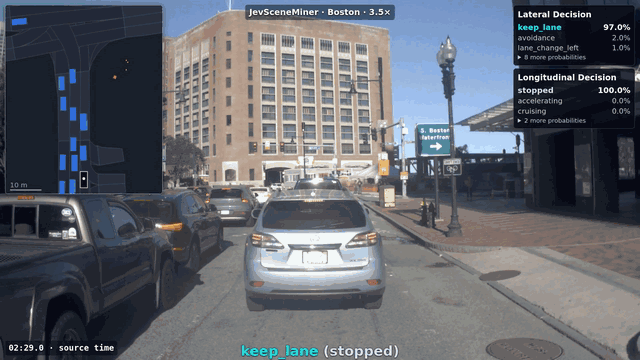

<div align="center">

# JevSceneMiner

**From driving logs to reviewable scenes.**

[](https://github.com/bskkimm/JevSceneMiner/actions/workflows/ci.yml)
[](pyproject.toml)
[](LICENSE)

[Demo](#boston-demo) · [Quick start](#quick-start) · [Usage](docs/usage.md) · [Schema](docs/schema.md) · [Contributing](CONTRIBUTING.md)

</div>

Mine maneuvers from **Autoware rosbags** and **nuPlan logs** with [Jev](https://docs.typesafe.ai/introduction).
Turn recorded motion, lane geometry and object interactions into readable evidence, then classify each moment and merge it into timestamped scenes.



*Turn right → lane change → keep lane. Preview from seconds 22–31 of our Boston showcase.*

## Boston demo

Press Play below. The video plays here, without autoplay or looping.

https://github.com/user-attachments/assets/2ac52a9c-eab8-43b9-90a8-15588abc860a

*Real nuPlan footage and Jev results. 1080p · 1 min 22 s · 3.5× playback · long stops shortened.*
[Demo details and data attribution](docs/demo.md).

## What you can do

- **Bring either source.** Rosbag + Lanelet2 or nuPlan + map produces the same sample schema; missing fields stay unknown.
- **Define scenes in plain language.** Edit [lateral and longitudinal labels](labels.yaml), with a probability for each answer.
- **Keep the full maneuver.** One lateral scene contains consecutive speed phases, such as braking, cruising and accelerating during a lane change.
- **Review the evidence.** Synchronized camera, bird's-eye view (BEV), scene timeline, raw probabilities and a ground-truth editor.

## Pipeline

```text
Autoware MCAP + Lanelet2 ─┐
                         ├─► preprocess ─► structured sample ─► Jev
nuPlan SQLite + map ──────┘                  facts + script        │
                                                                 ▼
                                                        raw probabilities
                                                                 │
                                              merge lateral scenes + speed phases
                                                                 │
                                                   camera / BEV / timeline / GT
```

Jev receives the **readable script**, with past and future observations around NOW.
Numerical facts remain alongside it for inspection. Camera images are used for review.

```text
One lateral scene:       lane_change_right
Consecutive speed phases: decelerating │ cruising │ accelerating
Output:                  start_ns / end_ns / driving_decision / longitudinal_phases
```

See a complete [sample](examples/sample.json), its [Jev input](examples/sample.txt) and [merged scenes](examples/scenes.json).

## Quick start

Linux · Python 3.10+ · [uv](https://docs.astral.sh/uv/getting-started/installation/).
Try the complete synthetic pipeline **without an API key**:

```bash
git clone https://github.com/bskkimm/JevSceneMiner.git
cd JevSceneMiner
uv sync --frozen
uv run python examples/pipeline_demo.py --source rosbag --out out/demo
uv run jevsceneminer view out/demo --gt out/demo-gt --port 8650
```

Open **http://127.0.0.1:8650**. The demo generates an MCAP, a map, processed samples and illustrative cached answers; API requests are blocked.
It includes timeline and script data. Camera review requires your own nuPlan sources and images.
Use `--source nuplan` with a new output directory to try the other adapter.

### Use your own logs

```bash
# Prepare inputs without calling the API.
uv run jevsceneminer run \
  --nuplan /path/to/log.db --nuplan-maps /path/to/maps \
  --preset nuplan-1hz --out out/nuplan --dry-run

# Set TYPESAFE_API_KEY in your environment or an ignored .env file first.
uv run jevsceneminer classify out/nuplan --maneuver-tail 2
uv run jevsceneminer view out/nuplan --gt out/nuplan-gt \
  --sensor-root /path/to/sensor_blobs --port 8650
```

The explicit `nuplan-1hz` preset uses **10 s past + 15 s future**, **1 Hz inference** and a **1 Hz table**.
Without a preset, defaults are 10 s past + 10 s future at 2 Hz.
See [usage](docs/usage.md) for rosbag inputs, options, outputs and remote viewing.

## Documentation

| Guide | Contents |
| --- | --- |
| [Usage](docs/usage.md) | Source setup, configuration, outputs and viewer |
| [Sample and scene schema](docs/schema.md) | Context, lane/body evidence and consecutive phases |
| [Evidence review](docs/review.md) | Opt-in annotations, missing actor history and selected reruns |
| [Evaluation](docs/evaluation.md) | Offline benchmark, independent GT and limitations |
| [Repository layout](docs/architecture.md) | Source groups and import compatibility |
| [Contributing](CONTRIBUTING.md) | Development checks and contribution contracts |

## Status and license

**Experimental, retrospective scene mining:** future observations provide context; this is offline analysis.
Map matching and polygon overlap are evidence, with physical lane ownership subject to source quality.
The demo is a reviewed example; representative accuracy requires [held-out evaluation](docs/evaluation.md).

Code and original synthetic examples: [Apache-2.0](LICENSE).
External recordings, maps and images retain their source terms. No raw driving dataset is included.
This independent project is not affiliated with TypeSafe AI or the nuPlan authors.
