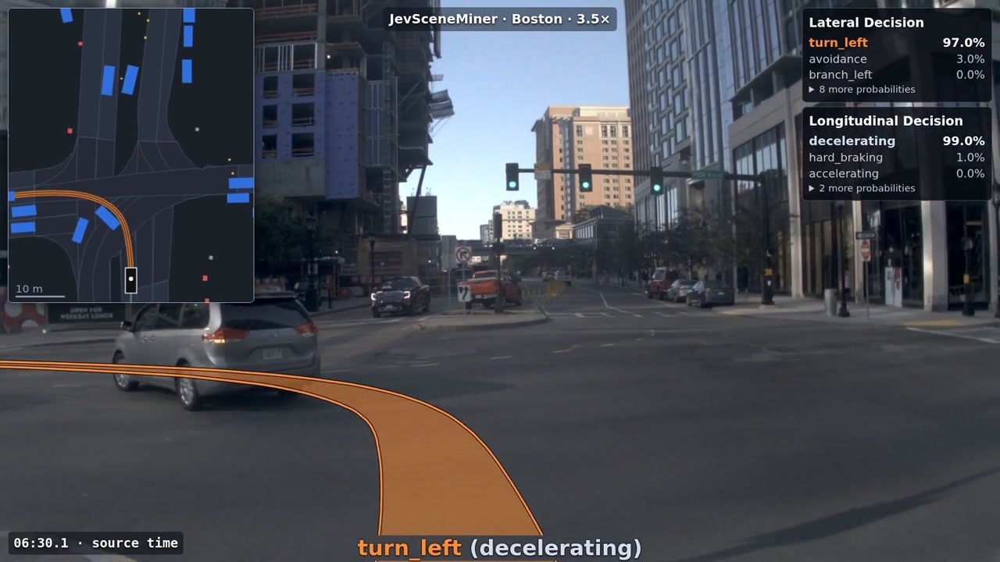

# Boston showcase

The README preview uses seconds 22–31 of the exported video: turn right, lane change, then keep lane.
It is centered and encoded as a looping 1920 × 1080, 8 fps animated WebP to keep
the transfer size smaller than an equivalent GIF.
The full video is visible directly in the README; playback starts when the reader presses Play and does not loop.

The README shows an actual Boston [nuPlan](https://www.nuscenes.org/nuplan) recording with Jev inference and merged driving decisions.
It is a curated review example, not a representative accuracy benchmark.

[Watch or download the showcase](https://github.com/user-attachments/assets/2ac52a9c-eab8-43b9-90a8-15588abc860a).

## What is shown

- Front camera with the recorded future 10 s path colored by merged lateral scene.
- Dark BEV with the same trajectory colors, a 50 m width and 60 m height, and ego 95% down.
- Raw lateral and longitudinal probabilities at top right, updated at 1 Hz.
- The merged lateral decision and current speed phase at the bottom.

The future path comes from logged ego poses, not a prediction.
Camera projection uses calibration and an approximate landmark-based height reference; it is not a surveyed road-surface reconstruction.
The source viewer also uses a local, approximate map-alignment review for selected BEV polygons; this is display-only and does not change Jev input evidence.
The dark theme and white ego outline were applied for the export.

## Run and review

| Setting | Value |
| --- | --- |
| Recording | `2021.10.06.19.27.33_veh-28_00805_01736` |
| Map | `us-ma-boston`, version `9.12.1817` |
| Model | `jev-1.13.0` |
| Questions / canonical sample | `jsm-1.4` / `jsm-sample-1.1` |
| Context | 10 s past, 15 s future |
| Inference / table cadence | 1 Hz / 1 Hz |
| Minimum lateral scene / speed phase | 2 s / 1 s |
| Minimum mean lateral support | 0.4 |
| Maneuver tail | Up to 2 s into following keep-lane |
| Indicator gate | Disabled; nuPlan has no recorded indicator |

The source run includes an opt-in, camera-reviewed same-lane annotation and supplemented history for a crossing actor.
These reviews are preserved as input provenance; they do not assign predicted labels and are not automatically applied to a new run.
The selected video clips fall outside both corrected NOW intervals.
See [review.md](review.md) for the review workflow and [evaluation.md](evaluation.md) for evaluation requirements.
A fresh native run can therefore differ from this reviewed run.

## Edit

Source times are elapsed from the driving log start:

| Clip | Start | End |
| --- | --- | --- |
| 1 | 00:17.5 | 03:28.9 |
| 2 | 06:10.7 | 08:09.4 |
| 3 | 13:53.0 | 14:50.9 |

Driving footage runs at **3.5×**. Two long stationary intervals in clip 1 are shortened, preserving 1.25 output seconds at each end.
Joins use 0.2 s crossfades, and a source-time badge makes the skips visible.
The silent H.264 video is 81.567 s at 30 fps; the README copy is 1920 × 1080.
No new inference was needed to export it.

## Data attribution

Footage and source driving data: [nuPlan](https://www.nuscenes.org/nuplan), created by [Motional](https://github.com/motional/nuplan-devkit).
The recording is from Boston on 2021-10-06.
External data and imagery retain the [dataset terms](https://www.nuscenes.org/terms-of-use), including the non-commercial restriction; the repository's Apache-2.0 license covers its code and original synthetic examples.
No raw logs, maps or camera-image collection is distributed in Git.
